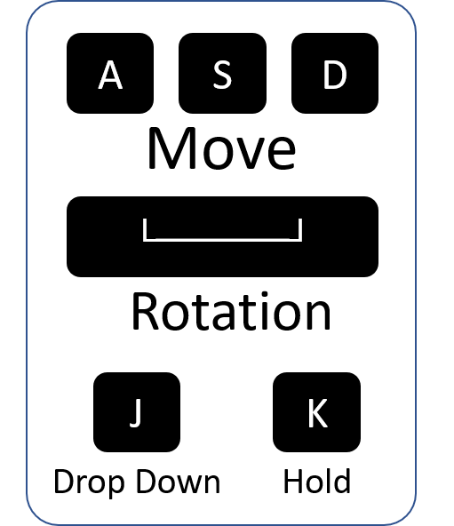
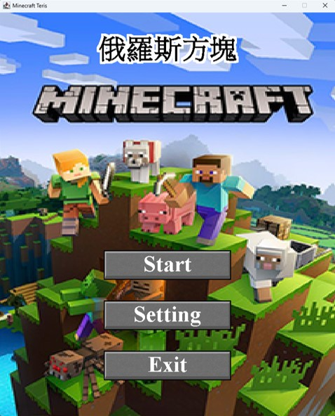
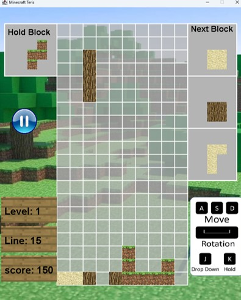
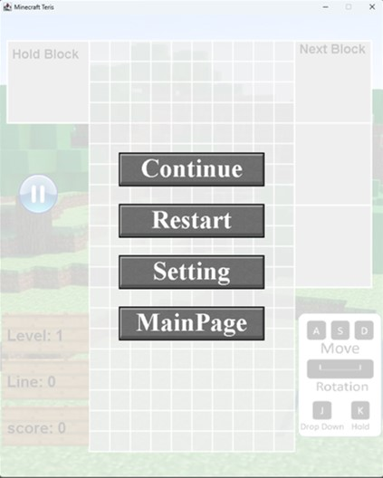
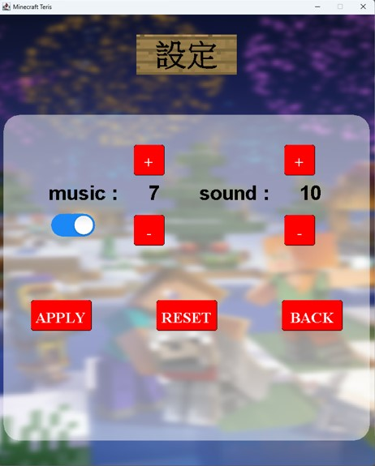
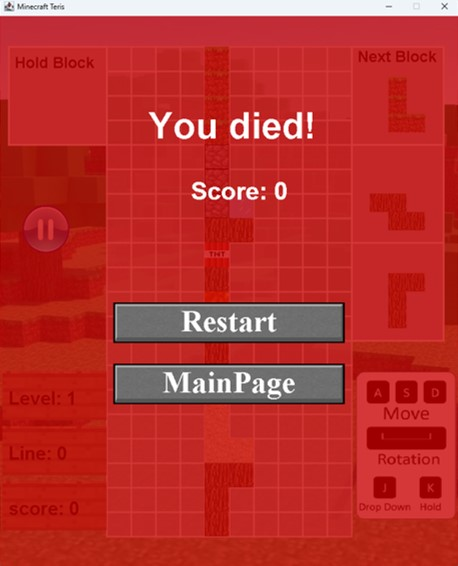

# 俄羅斯方塊 x 麥塊 / Tetris x Minecraft 

## 🔥 隆重介紹！New Game Release!🔥

融合經典俄羅斯方塊與 Minecraft 元素，「俄羅斯方塊 x 麥塊」帶來前所未有的俄羅斯方塊體驗！
在這款創新遊戲中，您將享受來自 Minecraft 方塊的視覺盛宴，並挑戰傳統俄羅斯方塊的極限。這不僅僅是一場遊戲，這是一場令人興奮的冒險！

Combining the classic Tetris with Minecraft elements, "Minecraft-themed Tetris" offers a puzzle experience like no other! 
Enjoy the visual feast of Minecraft blocks and push the limits of traditional Tetris. This isn't just a game; it's an exciting adventure!

## 🎮 遊戲特色 / Game Features
- **Minecraft Blocks**：  
    每個俄羅斯方塊都來自 Minecraft，充滿創造力和想像力。  
    Each puzzle piece is made of Minecraft blocks, full of creativity and imagination.  

- **特殊效果 / Special Effects**：  
    部分方塊帶有特殊效果，增加遊戲深度和挑戰性。  
    Some blocks have unique enchantment effects, adding depth and challenge to the game.  

- **多重難度 / Multiple Difficulties**：  
    隨著分數提升，挑戰難度逐漸加大，準備好迎接更快的速度吧！  
    As your score increases, the game becomes more challenging with faster speeds. Get ready for the ultimate test!

## 📜 遊戲規則 / Game Rules

### 分數計算 / Scoring :
- 消除一行：10 分 / Clear one line: 10 points
- 連續消除兩行：25 分 / Clear two lines consecutively: 25 points
- 連續消除三行：45 分 / Clear three lines consecutively: 45 points
- 連續消除四行：65 分 / Clear four lines consecutively: 65 points

### 困難度 / Difficulty :
隨著您的進步，遊戲將變得更具挑戰性！  

As you progress, the game becomes more challenging!

| Level | 掉落間隔 (ms) | 分數 | Drop Interval (ms) | Score |
|-------|---------------|------|-------------------|-------|
| 1     | 1500          | 200  | 1500              | 200    |
| 2     | 1200          | 400  | 1200              | 400   |
| 3     | 900           | 600  | 900               | 600   |
| 4     | 600           | 800  | 600               | 800   |
| 5     | 300           | 1000 | 300               | 1000   |

### 磚塊生成 (機率) / Block Generation (Probability)
1. **普通 Common（60%）**： 木頭或泥土 / Wood or Dirt 
2. **稀少 Rare（30%）**：沙子 / Sand
3. **特別 Special（10%）**：鵝卵石 / Cobblestone
4. **隨機組合 Random Combination (10%)**：水、岩漿、TNT / Water, Lava, TNT

### 磚塊消除 / Block Clearing
- **整行消除 Whole Line Clear**：  
  - 木頭、泥土、沙子(若下方沒有支撐則磚塊會繼續下墜)  
    Wood, Dirt, Sand ( continues to fall if unsupported )
- **特殊效果 Special Effects**：
  - 水：填滿下方的空格 / Water: Fills empty spaces below
  - 岩漿：消除下方的磚塊 / Lava: Clears all blocks below
  - TNT：消除周圍8格磚塊 / TNT: Clears surrounding 8 blocks

## 遊玩方式 / How to play
  

## 📸 遊玩影片 / Game Video

## 🖥️ 畫面展示 / Game Screenshots
主畫面 Start screen  
  
  
遊玩畫面 Play screen  
  

暫停畫面 Pause screen  
  

設定畫面 Setting screen  
  

死亡畫面  Dead screen  

## 📥 下載與執行 / Download and Execute
請從 [GitHub Releases](https://github.com/ZEO-Lab/Minecraft-themed-Tetris/releases) 下載最新JAR版本，並按照以下步驟執行：  
Please download the latest JAR version from [GitHub Releases](https://github.com/ZEO-Lab/Minecraft-themed-Tetris/releases) and follow these steps to install:

1. 下載最新版本。 Download the latest version.
2. 雙擊檔案運行遊戲。 Double-click the file to run the game.

## 👥 素材來源 / Source File
歡迎對本遊戲提出問題、貢獻或提供改進建議。相關素材請參考 [Source](Source.txt) 了解更多細節。  
We welcome issues, code contributions, and improvement suggestions. Please refer to [Source](Source.txt) for more details.

## 📄 授權 / License
本項目採用 MIT 授權條款，詳細內容請參閱 [LICENSE](LICENSE)。  
This project is licensed under the MIT License. See [LICENSE](path/to/license) for details.

---

🚀 **立即下載，開始您的俄羅斯方塊冒險吧！** 🚀  
🚀 **Download now and start your puzzle adventure!** 🚀
